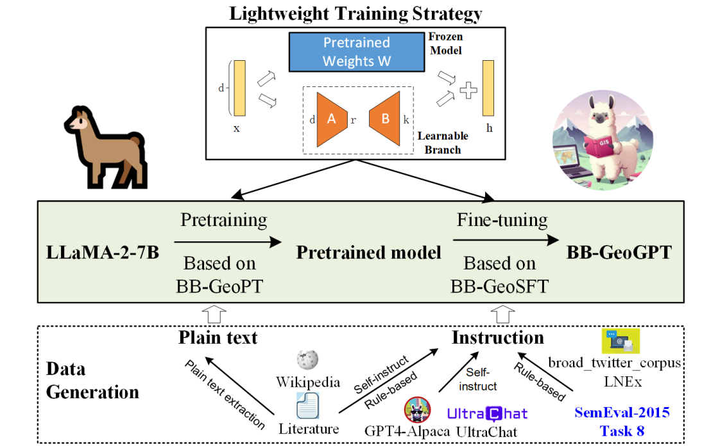

# BB-GeoGPT

The framework for training a large language model for the geographic information science, termed BB-GeoGPT.Firstly, a comprehensive set of training resources, comprising model pretraining data (BB-GeoPT) and supervised fine-tuning instructions (BB-GeoSFT) is curated. Then, BB-GeoGPT is obtained by first adapting an open-source general-domain LLM,LLaMA-2-7B model (Touvron et al., 2023b) to the pretraining data BB-GeoPT, and then utilizing the instruction tuning data BB-GeoSFT to further supervise fine-tuning the model. A lightweight training strategy is used in both of these stages.
